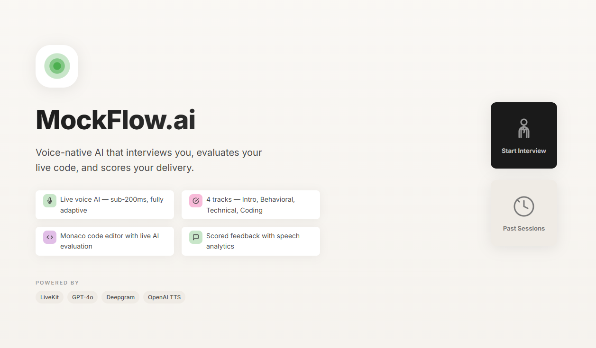

<div align="center">

```python
llm.invoke("Generate a bio")
```

<h1>SATYAM KUMAR</h1>

<p align="center">
  
</p>

<p align="center">
  <a href="https://krsatyam.vercel.app">
    
  </a>
  <a href="https://www.linkedin.com/in/krsatyam0605/">
    
  </a>
  <a href="https://github.com/satyam06050">
    
  </a>
  <a href="https://krsatyam.vercel.app/resume">
    
  </a>
</p>

<p>
  <em>"Build things that solve real problems. Everything else follows."</em>
</p>

</div>

## ⚡ The Arsenal
```python
class Satyam:
    languages = ["Python","Dart","SQL"]

    ai = ["LangChain", "LangGraph", "Cromadb"]

    backend = ["FastAPI", "Node.js", "PostgreSQL", "Supabase"]

    mobile = ["Flutter", "Firebase"]

    tools = ["Docker", "AWS", "Git", "GitHub", "Vercel"]

    building = ["AI Interview Platform", "KIIT Sync", "NeuralNavAI"]

```

<div align="center">

<picture>
  <source media="(prefers-color-scheme: dark)"
    srcset="https://raw.githubusercontent.com/satyam06050/satyam06050/output/github-snake-dark.svg">
  
</picture>

</div>

---

## 🚀 Currently Building

<div align="center">

<a href="https://github.com/satyam06050/IntervAI-AI-Interview-Platform">
  
</a>

<br/><br/>

<a href="https://github.com/satyam06050/IntervAI-AI-Interview-Platform">
  <b>🎤 AI Interview Platform</b>
</a>

<br/>

<sub>
Real-time AI mock interview platform featuring voice conversations, resume-aware interviews, AI feedback, and agentic workflows.
</sub>

</div>

---
## ✅ Built & Shipped

- **🎤 AI Interview Platform 🌟**: Real-time AI mock interview platform with voice conversations, resume-aware interviews, AI evaluation, and agentic workflows. [Link ↗](https://github.com/satyam06050/IntervAI-AI-Interview-Platform)

- **📱 KIIT Sync**: Campus companion app featuring timetable management, attendance tracking, subject analytics, and productivity tools for KIIT students. [Link ↗](https://github.com/satyam06050/KIIT-Sync)

- **🧠 NeuralNavAI**: AI-powered smart navigation assistant built with Flutter, integrating real-time guidance and intelligent interaction. [Link ↗](https://github.com/satyam06050/NeuralNavAI)

- **📂 FileDoc**: Multi-role document management platform consisting of User, Admin, and Mini Admin applications with a scalable backend architecture. [Link ↗](https://github.com/satyam06050/FileDoc)


<div align="center">
  
<br/><br/>
  
</div>